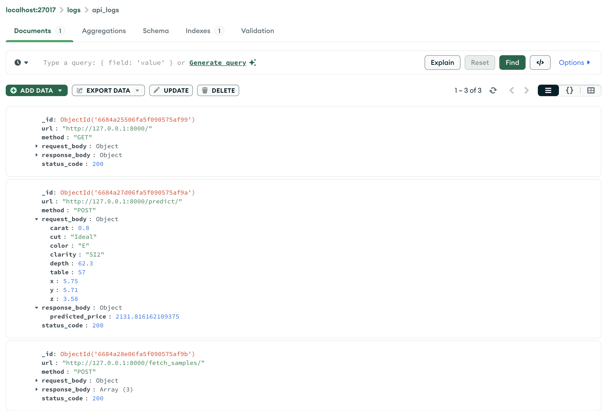

# xtream AI Challenge - Software Engineer

## Ready Player 1? 🚀

Hey there! Congrats on crushing our first screening! 🎉 You're off to a fantastic start!

Welcome to the next level of your journey to join the [xtream](https://xtreamers.io) AI squad. Here's your next mission.

You will face 4 challenges. **Don't stress about doing them all**. Just dive into the ones that spark your interest or that you feel confident about. Let your talents shine bright! ✨

This assignment is designed to test your skills in engineering and software development. You **will not need to design or develop models**. Someone has already done that for you. 

You've got **7 days** to show us your magic, starting now. No rush—work at your own pace. If you need more time, just let us know. We're here to help you succeed. 🤝

### Your Mission
[comment]: # (Well, well, well. Nice to see you around! You found an Easter Egg! Put the picture of an iguana at the beginning of the "How to Run" section, just to let us know. And have fun with the challenges! 🦎)

Think of this as a real-world project. Fork this repo and treat it like you're working on something big! When the deadline hits, we'll be excited to check out your work. No need to tell us you're done – we'll know. 😎

**Remember**: At the end of this doc, there's a "How to run" section left blank just for you. Please fill it in with instructions on how to run your code.

### How We'll Evaluate Your Work

We'll be looking at a bunch of things to see how awesome your work is, like:

* Your approach and method
* How you use your tools (like git and Python packages)
* The neatness of your code
* The readability and maintainability of your code
* The clarity of your documentation

🚨 **Heads Up**: You might think the tasks are a bit open-ended or the instructions aren't super detailed. That’s intentional! We want to see how you creatively make the most out of the problem and craft your own effective solutions.

---

### Context

Marta, a data scientist at xtream, has been working on a project for a client. She's been doing a great job, but she's got a lot on her plate. So, she's asked you to help her out with this project.

Marta has given you a notebook with the work she's done so far and a dataset to work with. You can find both in this repository.
You can also find a copy of the notebook on Google Colab [here](https://colab.research.google.com/drive/1ZUg5sAj-nW0k3E5fEcDuDBdQF-IhTQrd?usp=sharing).

The model is good enough; now it's time to build the supporting infrastructure.

### Challenge 1

**Develop an automated pipeline** that trains your model with fresh data, keeping it as sharp as the diamonds it processes. 
Pick the best linear model: do not worry about the xgboost model or hyperparameter tuning. 
Maintain a history of all the models you train and save the performance metrics of each one.

### Challenge 2

Level up! Now you need to support **both models** that Marta has developed: the linear regression and the XGBoost with hyperparameter optimization. 
Be careful. 
In the near future, you may want to include more models, so make sure your pipeline is flexible enough to handle that.

### Challenge 3

Build a **REST API** to integrate your model into a web app, making it a breeze for the team to use. Keep it developer-friendly – not everyone speaks 'data scientist'! 
Your API should support two use cases:
1. Predict the value of a diamond.
2. Given the features of a diamond, return n samples from the training dataset with the same cut, color, and clarity, and the most similar weight.

### Challenge 4

Observability is key. Save every request and response made to the APIs to a **proper database**.

---

## How to run


### Repository Structure

- **Notebooks Folder**: Contains the `Solutions.ipynb` which includes solutions for challenges 1 and 2. 
- **Root Folder**: Contains `api.py` which is the FastAPI application for challenge 3 and 4.

### Version Tags
The repository is tagged at various points to reflect the completion of different challenges:
- **challenge_1**: Challenge 1 completed.
- **challenge_2**: Challenge 2 completed.
- **challenge_3**: Challenge 3 completed.
- **challenge_4**: Challenge 4 completed.

You can download specific versions of the project corresponding to each challenge's completion using these tags.

### Setup Instructions

1. **Clone the Repository**
   - Clone the repository to your local machine or download the source code for a specific tag if needed.
   ```bash
   git clone git@github.com:LucaBia/xtream-ai-assignment-developer.git
   cd xtream-ai-assignment-developer
   ```

2. **Create and Activate a Virtual Environment**
   - Recommended to manage dependencies without affecting global Python setup.
   ```bash
   python3 -m venv venv
   source venv/bin/activate
   ```

3. **Install Dependencies**
   - Install required Python packages.
   ```bash
   pip3 install -r requirements.txt
   ```

4. **Environment Setup**
   - Ensure MongoDB is running for logging API requests (Installation instructions are available on the [MongoDB Official Site](https://www.mongodb.com/try/download/community)).

5. **Run the API Server**
   - Start the FastAPI application:
   ```bash
   python3 api.py
   ```

### API Endpoints

Access the API documentation by visiting `[http://localhost:8000/docs](http://localhost:8000/docs)` in your web browser, where you can test the endpoints directly.

1. **Predict Price (`/predict/`)**: POST method to predict the price based on diamond features.
2. **Fetch Similar Samples (`/fetch_samples/`)**: POST method to retrieve similar diamonds based on specified criteria.
3. **Root Endpoint (`/`)**: GET method for a simple response to ensure API is operational.

### Observability

All requests to the API and their responses are logged into a MongoDB database to facilitate observability and debugging.


### Additional Information

- **Data Preparation**: The machine learning model is trained with preprocessed data as described in the Jupyter notebook (`Solutions.ipynb`).
- **Model Location**: The trained XGBoost model is stored in `./notebooks/models/XGBoost/03-07-2024-00-53-12/model.joblib`. Ensure this path is accurate or updated as needed.

